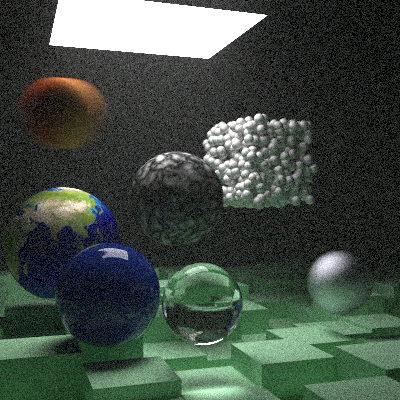

| Command | Mean [s] | Min [s] | Max [s] | Relative |
|:---|---:|---:|---:|---:|
| `./cpp/build/ppm` | 5.349 ± 0.282 | 4.943 | 5.800 | 2.06 ± 0.14 |
| `./rust/target/release/compare_nopar_bhv` | 8.087 ± 0.501 | 7.310 | 8.847 | 3.11 ± 0.23 |
| `./rust/target/release/compare_nopar_nobhv` | 6.224 ± 0.219 | 6.034 | 6.761 | 2.39 ± 0.13 |
| `./rust/target/release/compare_par_bvh` | 3.059 ± 0.056 | 2.978 | 3.125 | 1.18 ± 0.05 |
| `./rust/target/release/compare_par_nobhv` | 2.601 ± 0.111 | 2.462 | 2.765 | 1.00 |
| `./../rtiow-rust/target/release/compare_nopar_bhv` | 8.662 ± 0.184 | 8.429 | 9.093 | 3.33 ± 0.16 |
| `./../rtiow-rust/target/release/compare_nopar_nobhv` | 7.432 ± 0.178 | 7.153 | 7.846 | 2.86 ± 0.14 |
| `./../rtiow-rust/target/release/compare_par_bvh` | 3.515 ± 0.095 | 3.391 | 3.699 | 1.35 ± 0.07 |
| `./../rtiow-rust/target/release/compare_par_nobhv` | 3.086 ± 0.132 | 2.947 | 3.342 | 1.19 ± 0.07 |

